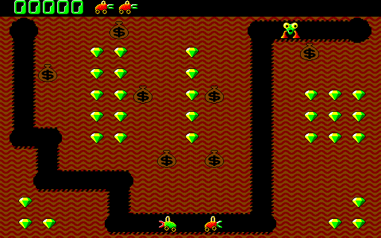
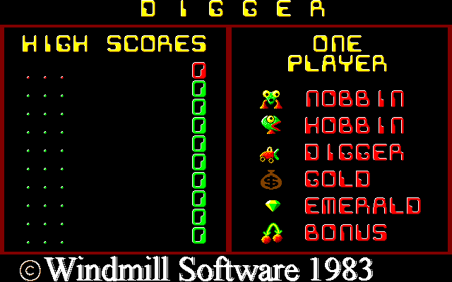
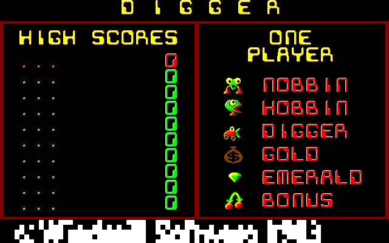
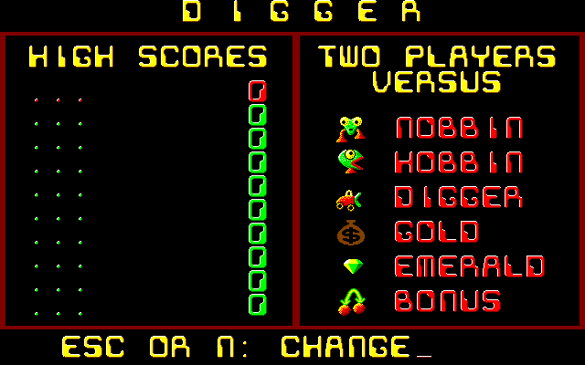
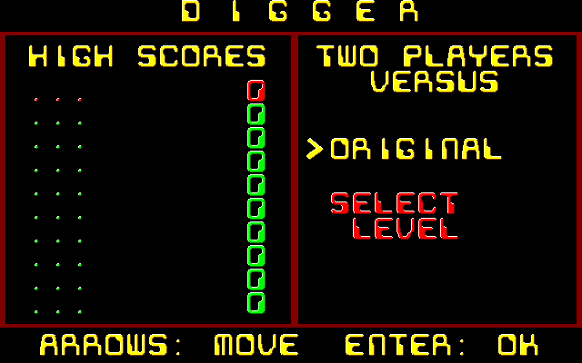
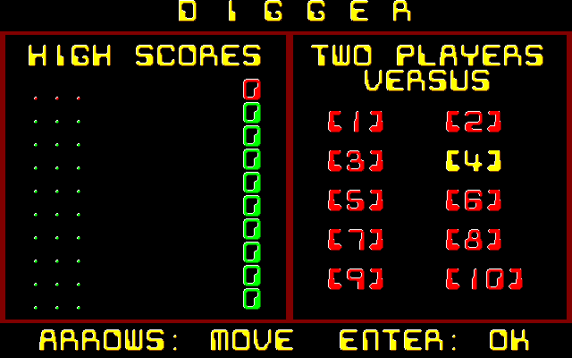
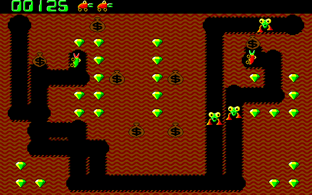
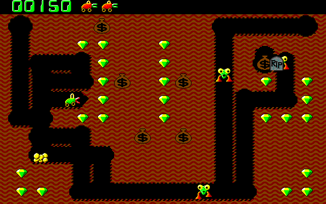
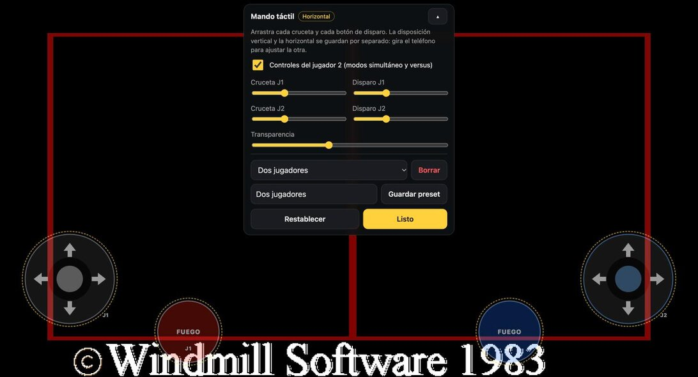

# Digger JS

**El clásico de PC de 1983, ahora en el navegador, con un modo para dos jugadores que comparten la partida.**

Port a JavaScript de *Digger Remastered* (Andrew Jenner) que funciona en navegadores de escritorio y del móvil, se instala como app y se puede jugar sin conexión.

### ▶ [Jugar ahora: gabom88.github.io/digger-js](https://gabom88.github.io/digger-js/)



*Modo TWO PLAYERS VERSUS: el Digger rojo (jugador 1) y el verde (jugador 2) excavan al mismo tiempo, con un solo marcador y las vidas compartidas.*

---

## Contenido

- [Un poco de historia](#un-poco-de-historia)
- [Cómo se juega](#cómo-se-juega)
- [La pantalla de título](#la-pantalla-de-título)
- [Modo TWO PLAYERS VERSUS](#modo-two-players-versus)
- [Todos los modos de juego](#todos-los-modos-de-juego)
- [Controles](#controles)
- [Mando táctil para uno o dos jugadores](#mando-táctil-para-uno-o-dos-jugadores)
- [Instalarlo como app](#instalarlo-como-app)
- [Para desarrolladores](#para-desarrolladores)
- [Créditos y licencia](#créditos-y-licencia)

---

## Un poco de historia

*Digger* lo publicó en **1983** la empresa canadiense **Windmill Software**, y su diseñador fue **Rob Sleath**. No se vendía como un programa que se ejecuta desde DOS: era un **disco de arranque** de 5¼" con protección anticopia. Se metía en la disquetera del IBM PC/XT, se encendía la máquina y el juego arrancaba solo. En 1984 se adaptó al IBM PCjr y al IBM JX.

El juego toma ideas de dos éxitos de los salones recreativos, ***Mr. Do!*** y ***Dig Dug***: excavas túneles bajo tierra, recoges esmeraldas y oro y te defiendes de los monstruos. En 1984 la revista *Creative Computing* dijo que combinaba lo mejor de *Pac-Man* y *Dig Dug*, y que no perdía su encanto ni después de horas de juego.

Mucha gente lo recuerda por su música, que sonaba por el altavoz interno del PC con una técnica de modulación por ancho de pulso muy avanzada para 1983:

- Mientras juegas suena **«Popcorn»**, el tema electrónico de Gershon Kingsley.
- En el modo bonus suena la **obertura de *Guillermo Tell***, de Rossini.
- Cuando Digger muere suena la **marcha fúnebre** de la Sonata para piano n.º 2 de Chopin, y aparece una lápida con «RIP».

En **1998**, **Andrew Jenner** creó ***Digger Remastered*** mediante ingeniería inversa. Funciona en cualquier PC y conserva la jugabilidad del original, y añade gráficos VGA, control de velocidad, teclas configurables, el modo Gauntlet y un modo de dos jugadores simultáneos. Se distribuye bajo licencia GPL con permiso de Rob Sleath. Andrew Jenner también mantiene [digger.org](http://www.digger.org/), el sitio de referencia sobre Digger y Windmill Software.

**Digger JS** traduce a JavaScript el código C de *Digger Remastered*, que está en la raíz de este repositorio. Se conservan los nombres de funciones y variables del C para que se pueda comparar línea a línea. Sobre esa base se añadieron el modo VERSUS, la selección de nivel, los controles táctiles, el mando y la instalación como app.

---

## Cómo se juega

Llevas a **Digger**, una excavadora que abre túneles por la tierra. Un nivel se pasa al **recoger todas las esmeraldas** o al **eliminar a todos los monstruos**.

| Elemento | Qué es |
|---|---|
| **Esmeralda** | 25 puntos. Si recoges 8 seguidas sin pausa, ganas 250 puntos extra. |
| **Bolsa de oro** | Se empuja hacia los lados y cae si le quitas la tierra de debajo. Si cae desde lo alto se rompe y deja oro (500 puntos). Al caer aplasta lo que encuentra: monstruos, esmeraldas… y a ti. |
| **Nobbin** | El monstruo de ojos saltones. No excava: solo recorre los túneles. Con el tiempo puede convertirse en Hobbin. |
| **Hobbin** | Abre su propio camino a través de la tierra para alcanzarte. Al rato vuelve a ser Nobbin. |
| **Disparo** | Elimina a un monstruo (250 puntos). Después hay que esperar a que se recargue. |
| **Bonus** (cerezas) | Aparece en la esquina superior derecha cuando ya salieron todos los monstruos del nivel. Al comerla (1000 puntos), la pantalla parpadea y durante un rato puedes **comerte a los monstruos**: 200, 400, 800… puntos cada uno. |

Ganas una vida extra cada **20 000 puntos**.

---

## La pantalla de título

Al pulsar la primera tecla, el letrero **«© Windmill Software 1983»** desaparece al estilo de las consolas de 8 bits. Primero se pixela en bloques cada vez más grandes y después los bloques se apagan uno a uno. En su lugar aparece la ayuda, escrita letra a letra.

| El título original | El letrero se desvanece |
|---|---|
|  |  |

Con **Esc** o **N** se cambia de modo: **ONE PLAYER → TWO PLAYERS → TWO PLAYERS VERSUS**. Con cualquier otra tecla, el juego pregunta cómo quieres jugar:

- **ORIGINAL**: los niveles van uno tras otro, como en el juego de 1983.
- **SELECT LEVEL**: eliges el nivel inicial, del 1 al 10. Del 10 en adelante la dificultad ya no sube.

| Elegir el modo | ORIGINAL o SELECT LEVEL | Selección de nivel |
|---|---|---|
|  |  |  |

En la cuadrícula de niveles, las flechas mueven el indicador **>** y **Enter** empieza la partida. **Esc** o **N** vuelve un paso atrás.

---

## Modo TWO PLAYERS VERSUS

Es el modo nuevo de esta versión: **dos jugadores en la misma pantalla y al mismo tiempo**, compartiendo la partida.



### Reglas

- **Los dos Digger salen a la vez.** El jugador 1 (rojo) empieza a la derecha y el jugador 2 (verde) a la izquierda.
- **Un solo marcador.** Cada esmeralda, bolsa de oro o monstruo suma al mismo puntaje. Arriba se ve una sola puntuación.
- **Vidas compartidas.** El equipo empieza con 3 vidas, y los iconos de arriba son las vidas de reserva de los dos.
- **Si uno muere, revive.** Mientras queden vidas, el Digger que muere vuelve a su punto de partida y gasta una vida del equipo. Su compañero sigue jugando.
- **La última vida.** Si las vidas se acaban, el Digger que muere ya no revive y su compañero juega la última vida. Si el equipo gana una vida extra (cada 20 000 puntos), el caído vuelve a la partida.
- **Al pasar de nivel** los dos Digger vuelven a su posición inicial.
- **Cuidado con el fuego amigo.** Como en el modo simultáneo original, el disparo de un jugador puede eliminar a su compañero, y eso cuesta una vida del equipo.
- **Récords.** La puntuación del equipo entra en la tabla de «2 jugadores simultáneo».



*Al Digger rojo le cayó una bolsa encima (la lápida RIP). El verde sigue excavando, y el rojo volverá a su punto de partida gastando una vida del equipo.*

### Cómo jugar VERSUS

1. En el título, pulsa **Esc** o **N** hasta que arriba a la derecha diga **TWO PLAYERS VERSUS**.
2. Pulsa cualquier otra tecla y elige **ORIGINAL** o **SELECT LEVEL**.
3. El jugador 1 usa las **flechas** y **Enter**. El jugador 2 usa **W A S D** y **Tab**.
4. En el móvil o la tablet, activa los **controles del jugador 2** en el editor del mando táctil (ver más abajo). Cada jugador tiene su cruceta y su botón de disparo.

---

## Todos los modos de juego

| Modo | Cómo se elige | Descripción |
|---|---|---|
| **ONE PLAYER** | Título (Esc/N) | El juego original para un jugador. |
| **TWO PLAYERS** | Título (Esc/N) | Dos jugadores por turnos, como en 1983. Cada uno tiene sus vidas, su puntuación y su nivel. |
| **TWO PLAYERS VERSUS** | Título (Esc/N) | Dos Digger a la vez con puntos y vidas compartidos. |
| 2 jugadores simultáneo | Menú → Juego | El modo de *Digger Remastered*: dos Digger a la vez, cada uno con sus vidas y sus puntos. |
| Gauntlet | Menú → Juego | Contrarreloj de *Digger Remastered*: sumar todos los puntos posibles antes de que se acabe el tiempo. |

En el menú también se puede cambiar el nivel inicial del modo ORIGINAL, la velocidad del juego, el sonido y la música, y activar vidas ilimitadas.

---

## Controles

Todas las teclas se pueden cambiar en **Menú → Teclas**.

| Acción | Jugador 1 | Jugador 2 |
|---|---|---|
| Moverse | Flechas (o teclado numérico) | W A S D |
| Disparar | Enter o F1 | Tab |

| Sistema | Teclas |
|---|---|
| Cambiar modo / volver atrás (título) | Esc o N |
| Pausa | Espacio o P |
| Salir al título | F10 o Q |
| Más rápido / más lento | + / − |
| Música sí/no | F7 o M |
| Sonido sí/no | F9 o O |

**Mando (Gamepad):** cruceta o palanca para moverse, A/B/X/Y para disparar, Start para pausar y Select para volver al título.

---

## Mando táctil para uno o dos jugadores

En el móvil y en la tablet aparece un mando en pantalla. Al activar **Menú → Táctil → Mostrar controles táctiles** se abre el editor sobre el juego, y puedes **arrastrar y cambiar el tamaño** de cada control mientras lo ves.



- **Controles del jugador 2:** una segunda cruceta y un segundo disparo, en azul. Solo aparecen en los modos simultáneo y VERSUS.
- **Tamaño por jugador:** la cruceta y el disparo de cada jugador tienen su propio tamaño. La transparencia es común.
- **Vertical y horizontal por separado:** cada orientación guarda su propia disposición. Gira el teléfono para ajustar la otra.
- **Presets:** «Guardar preset» guarda la disposición completa con un nombre: las dos orientaciones, los tamaños, la transparencia y si el jugador 2 está activo. Se carga desde el editor o desde la pestaña Táctil.
- **En el título:** la cruceta cambia de modo, el disparo continúa y el botón de pausa vuelve atrás.

---

## Instalarlo como app

El juego es una PWA: se instala como app y funciona **sin conexión** una vez cargado.

- **iPhone / iPad:** abre la página en Safari → botón Compartir → **«Añadir a pantalla de inicio»**.
- **Android / Chrome / Edge:** botón **«Instalar como app»** en el menú del juego, o la opción de instalar del navegador.

---

## Para desarrolladores

### Estructura

| Ruta | Contenido |
|---|---|
| `web/` | El juego en JavaScript (es lo que se publica). Detalle en [web/README.md](web/README.md). |
| `web/js/engine.js` | El motor, traducido de `main.c`, `digger.c`, `monster.c`, `bags.c`, `sound.c` y los demás archivos C. |
| `web/js/video.js` | Framebuffer indexado de 640×400 con las paletas VGA originales. |
| `web/js/touch.js` | Mando táctil de uno o dos jugadores y su editor. |
| `tools/` | `serve.py` (servidor local sin caché) y `convert-assets.mjs` (convierte los gráficos del C). |
| `docs/screenshots/` | Las imágenes de este README. |
| Raíz | Código C original de *Digger Remastered*. |

### Probarlo en local

```sh
python3 tools/serve.py 8000
```

Abre http://localhost:8000/. Los módulos ES y el audio no funcionan si se abre `index.html` directamente como archivo.

### Publicar

Cada push a `main` publica la carpeta `web/` en GitHub Pages mediante el workflow `.github/workflows/pages.yml`. Al cambiar archivos del juego, sube `VERSION` en `web/sw.js`: así quien lo tenga instalado recibe la versión nueva.

### Capturas

Las capturas del juego se generaron ejecutando el motor real en Node.js y guardando su framebuffer como PNG, con los dos jugadores controlados por un guion. La del editor táctil es del navegador.

---

## Créditos y licencia

- **Digger** © 1983 Windmill Software. Diseño de Rob Sleath.
- **Digger Remastered** © 1998-2004 Andrew Jenner, con permiso de Rob Sleath.
- **Digger JS**: port a JavaScript, modo TWO PLAYERS VERSUS, selección de nivel y mando táctil para dos jugadores.

Se distribuye bajo la **GNU General Public License v2** (ver [COPYING](COPYING) y [copyright.txt](copyright.txt)).

### Fuentes de la historia

- [Digger (video game), Wikipedia](https://en.wikipedia.org/wiki/Digger_(video_game))
- [Digger en MobyGames](https://www.mobygames.com/game/18)
- [digger.org](http://www.digger.org/), el sitio de Andrew Jenner
